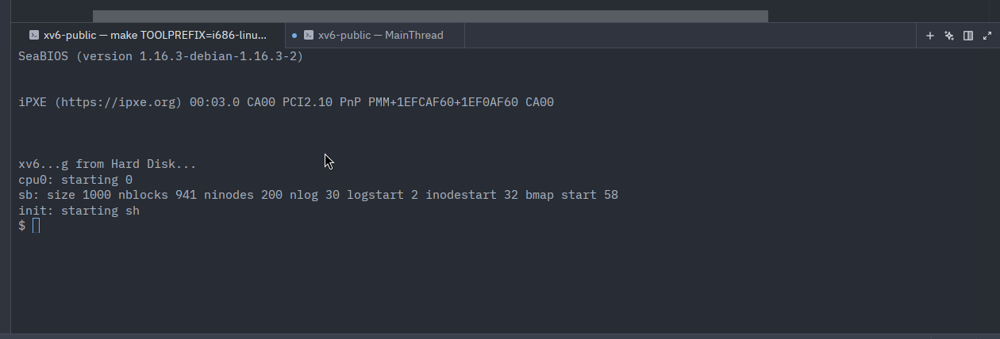
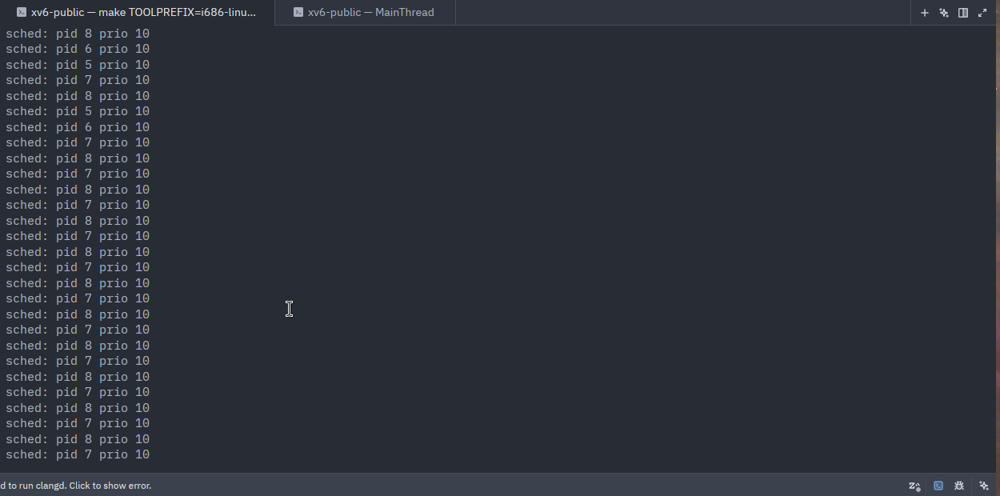
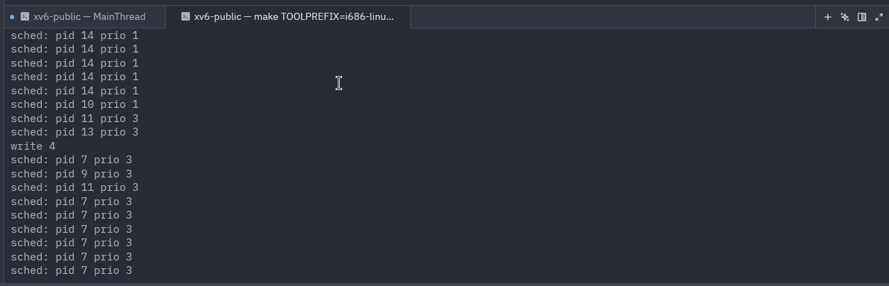

# Exercise 7 — XV6 Priority Scheduling (Text Answers, Parts A-E)

> Convention used throughout (stated in Lecture 8 slide 22 and re-stated
> in the assignment): **lower priority value = higher scheduling
> priority.** Round-robin is used among ties.

## Part A — Understanding the policy

**1.** Which process should be selected first?

| Process | State     | Priority |
|---------|-----------|----------|
| P1      | RUNNABLE  | 4        |
| P2      | SLEEPING  | 1        |
| P3      | RUNNABLE  | 2        |
| P4      | RUNNABLE  | 5        |

P2 is **SLEEPING** and is therefore not eligible — the scheduler only
considers RUNNABLE processes. Among the runnable ones (P1, P3, P4) the
priorities are 4, 2, 5. The smallest is 2, which belongs to **P3**.

**Answer: P3.**

**2.** Runnable: P1 prio 3, P2 prio 1, P3 prio 1, P4 prio 2. Which
statement is correct?

The two smallest-priority processes are P2 and P3 (both 1). They tie
for highest priority and one of them must run before the others.

**Answer: (b) "P2 and P3 should be preferred over P1 and P4."**

(a is wrong — P4 has priority 5 which is lower priority than everyone
else; c is wrong — P1 has priority 3, lower than P3's 1; d is wrong —
priority absolutely matters.)

## Part B — Scheduler logic

```c
best = 0;
for each process p in process table:
    if p.state != RUNNABLE:
        continue;
    if best == 0 || ____________:
        best = p;
```

We want to overwrite `best` whenever the candidate `p` is *more
preferred* than `best`. With "smallest value = highest priority", that
means `p->priority < best->priority`.

**Answer: (b) `p->priority < best->priority`.**

## Part C — Required kernel modifications

**1.** Which must be added to the process structure?

We need a per-process integer field that holds the priority value.

**Answer: (a) `int priority;`.**

(b is for lottery scheduling, not what's described; c is irrelevant —
the name field already exists; d is for aging schemes, not required by
this assignment.)

**2.** Which scheduler behavior must change vs. standard round-robin?

Standard xv6 RR scans the table and dispatches the first RUNNABLE
process it finds. The new policy must instead *find* the RUNNABLE
process with the highest priority (smallest value) before dispatching.

**Answer: (c) "The scheduler must scan runnable processes and choose
the one with highest priority."**

## Part D — Reading scheduler outcomes

Always-runnable: P1 priority 2, P2 priority 0, P3 priority 1.

Smallest priority value is 0, held by **P2**.

**Answer: P2.**

## Part E — Tie handling

Runnable: P1 prio 1, P2 prio 1, P3 prio 3. Round-robin among ties.

P1 and P2 tie for highest priority. P3 has the lowest priority and
must wait until the other two are no longer runnable. Within the tied
pair, RR makes them alternate over time.

**Answer: (c) "P1 and P2 should alternate over time before P3 is
chosen."**

---

# Exercise 7 — Part F: One-Page Report (XV6 Priority Scheduler)
## Transparency Notice: This Report was written with the help of AI for organization purposes

## 1) What I changed

I implemented priority scheduling in xv6 (x86 `xv6-public`) by modifying only `proc.h` and `proc.c`, as required:

1. Added a per-process integer priority field (`int priority`) to `struct proc`.
2. Added `#define DEFAULT_PRIORITY 10` in `proc.h`.
3. Initialized each new process with default priority in `allocproc()`.
4. Replaced the scheduler selection logic so it always picks the RUNNABLE process with the **smallest** priority value.
5. Added round-robin behavior among equal-priority RUNNABLE processes using a rotating scan start index (`last_idx`).

This keeps scheduler preemption behavior unchanged (timer interrupt path untouched) and does not alter locking, process states, or process lifecycle (`fork/exit/wait` remain compatible).

## 2) Full commented code (all required modifications)

### `proc.h`

```c
#define DEFAULT_PRIORITY 10  // mid-range default (smaller = higher prio)

struct proc {
  uint sz;                     // Size of process memory (bytes)
  pde_t* pgdir;                // Page table
  char *kstack;                // Bottom of kernel stack for this process
  enum procstate state;        // Process state
  int pid;                     // Process ID
  int priority;                // Scheduling priority (smaller = higher).
  struct proc *parent;         // Parent process
  struct trapframe *tf;        // Trap frame for current syscall
  struct context *context;     // swtch() here to run process
  void *chan;                  // If non-zero, sleeping on chan
  int killed;                  // If non-zero, have been killed
  struct file *ofile[NOFILE];  // Open files
  struct inode *cwd;           // Current directory
  char name[16];               // Process name (debugging)
};
```

### `proc.c` (`allocproc()`)

```c
found:
  p->state = EMBRYO;
  p->pid = nextpid++;
  p->priority = DEFAULT_PRIORITY;  // assign default priority at creation
```

### `proc.c` (`scheduler()`)

```c
void
scheduler(void)
{
  struct proc *p;
  struct cpu *c = mycpu();
  static int last_idx = NPROC - 1;  // rotating start for RR among ties
  c->proc = 0;

  for(;;){
    struct proc *best;
    int best_idx;
    int k, idx;

    sti();  // keep scheduler preemptive / interrupt-friendly

    acquire(&ptable.lock);
    best = 0;
    best_idx = -1;

    // Single pass: choose RUNNABLE process with smallest priority value.
    // Scan starts after last dispatched slot to ensure RR for equal priority.
    for(k = 0; k < NPROC; k++){
      idx = (last_idx + 1 + k) % NPROC;
      p = &ptable.proc[idx];
      if(p->state != RUNNABLE)
        continue;
      if(best == 0 || p->priority < best->priority){
        best = p;
        best_idx = idx;
      }
    }

    if(best){
      c->proc = best;
      switchuvm(best);
      best->state = RUNNING;
      last_idx = best_idx;  // rotate next scan origin
      swtch(&(c->scheduler), best->context);
      switchkvm();
      c->proc = 0;
    }
    release(&ptable.lock);
  }
}
```

## 3) Output log + screenshot evidence plan (exact timing)

1. **Screenshot A (boot/compatibility):** right after boot when shell appears (`$` prompt).  
   Confirms kernel still boots and basic lifecycle/syscalls are not broken.



2. **Screenshot B (equal-priority RR):** during a tie test (two RUNNABLE processes with same smallest priority), capture interleaving/alternation lines. Logging was added temorarly for this. It shows 2 (actually 4, 2 pids of them matter only) pids running in turns. Command ran was 

```bash
stressfs &
stressfs &
```



3. **Screenshot C (mixed priorities):** capture a run where high-priority tasks dominate and lower-priority tasks appear later or less often.
   For this test only, priorities are hardcoded in `allocproc()` as:
   `pid >= 5 && even -> prio 1`, `pid >= 5 && odd -> prio 3`.

```bash
stressfs &
stressfs &
stressfs &
```

Take the screenshot when `sched:` logs show many `prio 1` selections first, with `prio 3` scheduled later/less frequently.


